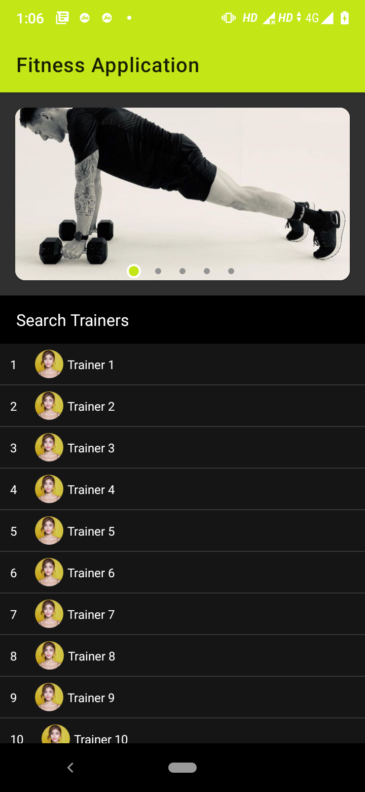

## Simple Android App  

Simple Android Application to demonstrate MVVM, Hexagonal Architecture with separation of concern.

## Screenshots

Libraries Used
--------------
* [Architecture](https://developer.android.com/topic/libraries/architecture)
    * [ViewModel](https://developer.android.com/topic/libraries/architecture/viewmodel) - Store UI-related data that isn't destroyed on app rotations. Easily schedule asynchronous tasks for optimal execution.
    * [LiveData](https://developer.android.com/topic/libraries/architecture/livedata) - Build data objects that notify views when the underlying database changes.
    * [Lifecycles](https://developer.android.com/topic/libraries/architecture/lifecycle) - Create a UI that automatically responds to lifecycle events.
    * [Data Binding](https://developer.android.com/topic/libraries/data-binding/) - Library that allows you to bind UI components in your layouts to data sources in your app using a declarative format rather than programmatically.
* [Dependency Injection](https://en.wikipedia.org/wiki/Dependency_injection)
    * [HILT](https://developer.android.com/training/dependency-injection/hilt-android) - Hilt is built on top of the popular DI library Dagger to benefit from the compile time correctness, runtime performance, scalability, and Android Studio support that Dagger provides. Recommended by Android.

Common Features
-------------------

* Hexagonal Clean Architecture
* Adhering to SOLID Principles
* Repository Pattern for code separations
* Dependency Injection 